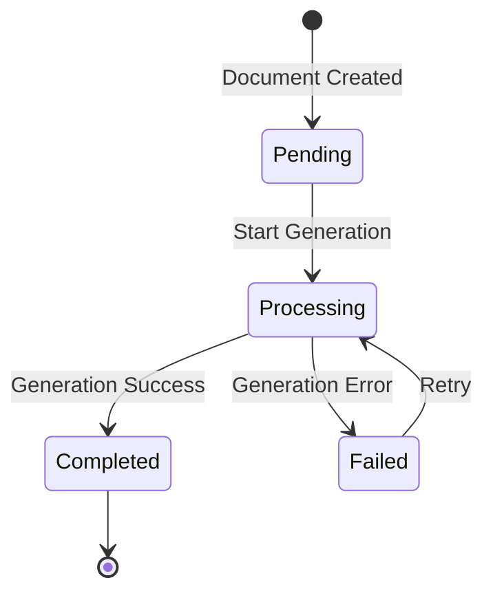

The API supports various payroll and tax document types. Each document type has its own structure, validation rules, and processing requirements.

## Supported Types

```php
enum DocumentType: string
{
    case PAYSTUB = 'Paystub';
    case W2 = 'W2';
    case MISC1099 = '1099-MISC';
    case INVOICE = 'Invoice';
}
```

## Document States

```php
enum DocumentStatus: string
{
    case PENDING = 'Pending';
    case PROCESSING = 'Processing';
    case COMPLETED = 'Completed';
    case FAILED = 'Failed';
}
```

## Document Structure

### Base Document Properties
```json
{
  "uuid": "123e4567-e89b-12d3-a456-426614174000",
  "type": "Paystub",
  "template_id": "template_1",
  "color_id": "blue",
  "quantity": 1,
  "content": {},
  "storage_data": {},
  "status": "Completed"
}
```

## Document Types

### 1. Paystub
Pay statements for employees with earnings and deductions.

```json
{
  "type": "Paystub",
  "content": {
    "company": {
      "name": "Acme Inc",
      "address1": "123 Main St",
      "city": "New York",
      "state": "NY",
      "zip": "10001"
    },
    "employee": {
      "name": "John Doe",
      "id": "EMP123",
      "ssn": "XXX-XX-1234"
    },
    "earnings": [
      {
        "name": "Regular",
        "hours": 80,
        "rate": 25.00,
        "amount": 2000.00
      }
    ],
    "deductions": [
      {
        "name": "Federal Tax",
        "amount": 300.00
      }
    ]
  }
}
```

### 2. W2
Annual wage and tax statements.

```json
{
  "type": "W2",
  "content": {
    "year": 2024,
    "employer": {
      "ein": "12-3456789",
      "name": "Acme Inc",
      "address": "123 Main St"
    },
    "employee": {
      "ssn": "XXX-XX-1234",
      "name": "John Doe",
      "address": "456 Oak St"
    },
    "earnings": {
      "wages": 75000.00,
      "federalTax": 15000.00,
      "socialSecurity": 4650.00,
      "medicare": 1087.50
    }
  }
}
```

### 3. 1099-MISC
Miscellaneous income statements.

```json
{
  "type": "1099-MISC",
  "content": {
    "year": 2024,
    "payer": {
      "tin": "12-3456789",
      "name": "Acme Inc",
      "address": "123 Main St"
    },
    "recipient": {
      "tin": "XXX-XX-1234",
      "name": "John Doe",
      "address": "456 Oak St"
    },
    "income": {
      "rents": 0,
      "royalties": 0,
      "other": 5000.00,
      "federal": 0
    }
  }
}
```

### 4. Invoice
Business invoices and billing documents.

```json
{
  "type": "Invoice",
  "content": {
    "invoice_number": "INV-2024-001",
    "date": "2024-01-29",
    "due_date": "2024-02-28",
    "business": {
      "name": "Acme Inc",
      "address": "123 Main St"
    },
    "client": {
      "name": "XYZ Corp",
      "address": "789 Pine St"
    },
    "items": [
      {
        "description": "Consulting Services",
        "quantity": 10,
        "rate": 150.00,
        "amount": 1500.00
      }
    ],
    "totals": {
      "subtotal": 1500.00,
      "tax": 150.00,
      "total": 1650.00
    }
  }
}
```

## Document Processing Flow



## Validation Rules

### Paystub
- Valid company information
- Employee details with masked SSN
- Balanced earnings and deductions
- Valid pay period dates

### W2
- Valid tax year
- Required employer EIN
- Valid SSN format (masked)
- Balanced tax calculations

### 1099-MISC
- Valid tax year
- Payer TIN required
- Recipient TIN required
- At least one income field > 0

### Invoice
- Unique invoice number
- Valid date formats
- Required business details
- At least one line item

## Templates

Each document type supports multiple templates:

```json
{
  "template": {
    "id": "template_1",
    "name": "Standard",
    "type": "Paystub",
    "colors": ["blue", "green", "red"],
    "versions": ["us", "ca"]
  }
}
```

## Document Generation

### Process Flow
1. Validate input data
2. Apply template
3. Generate PDF
4. Store in storage
5. Update status

### Example Code
```php
$document = Document::create([
    'type' => DocumentType::PAYSTUB,
    'content' => $validatedData,
    'template_id' => 'template_1',
    'status' => DocumentStatus::PENDING
]);

// Start processing
$document->update(['status' => DocumentStatus::PROCESSING]);

try {
    // Generate PDF
    $pdf = $this->generatePDF($document);

    // Store PDF
    $storageData = $this->storePDF($pdf);

    // Update document
    $document->update([
        'storage_data' => $storageData,
        'status' => DocumentStatus::COMPLETED
    ]);
} catch (Exception $e) {
    $document->update([
        'status' => DocumentStatus::FAILED,
        'errors' => [$e->getMessage()]
    ]);
}
```

## Security Measures

1. **Data Protection**
- SSN/TIN masking
- Encrypted storage
- Access control

2. **Audit Trail**
- Creation logs
- Access logs
- Modification tracking

3. **Permissions**
- Type-specific access
- Template restrictions
- Download controls

## Best Practices

1. **Input Validation**
```php
// Validate document data
$validator = Validator::make($request->all(), [
    'type' => ['required', new Enum(DocumentType::class)],
    'content' => ['required', 'array'],
    'content.company.name' => ['required', 'string'],
    // ... more rules
]);
```

2. **Error Handling**
```php
try {
    $document = $this->generateDocument($data);
} catch (ValidationException $e) {
    // Handle validation errors
} catch (GenerationException $e) {
    // Handle generation errors
} catch (StorageException $e) {
    // Handle storage errors
}
```

3. **Performance**
```php
// Queue document generation
DocumentGenerationJob::dispatch($document);
```

## Common Issues

1. **Data Formatting**
- Date formats
- Number precision
- Address formatting
- Name formats

2. **PDF Generation**
- Template errors
- Font issues
- Layout problems
- Size limits

3. **Storage**
- Space management
- Backup strategy
- Access speeds
- Cleanup policy

## Testing

1. **Test Data Sets**
```php
$testData = [
    'paystub' => [
        'valid' => [...],
        'invalid' => [...],
    ],
    'w2' => [...],
    '1099' => [...],
    'invoice' => [...]
];
```

2. **Validation Tests**
```php
public function test_validates_required_fields()
{
    $data = $this->getTestData('paystub');
    $validator = new DocumentValidator($data);
    $this->assertTrue($validator->passes());
}
```

## Monitoring

1. **Generation Metrics**
- Success rates
- Processing times
- Error patterns

2. **Storage Metrics**
- Space usage
- Access patterns
- Cache hits

3. **Performance Metrics**
- Queue length
- Processing speed
- Resource usage