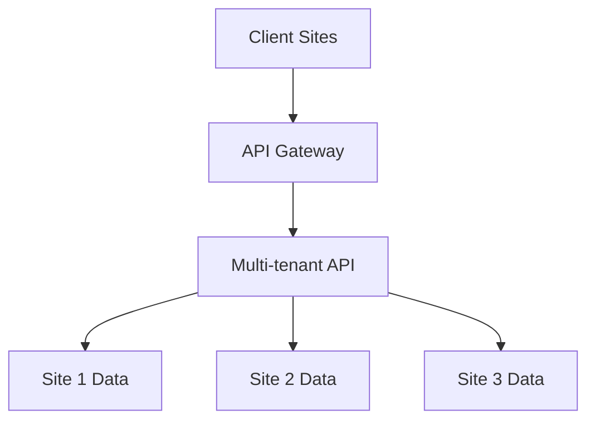

The Payroll Service API is designed as a multi-tenant system, powering multiple payroll service websites through a single API. Each tenant (site) has its own configuration, users, and data isolation.

## Tenant Architecture



## Site Configuration

Each site is configured with:

```json
{
  "identifier": "psn", // 3-letter unique identifier
  "name": "PaystubsNow",
  "logo": "https://...",
  "domains": ["paystubsnow.com", "psn-api.paystub.dev"],
  "payment_processors": ["Stripe", "PayPal"],
  "document_types": ["Paystub", "W2", "1099-MISC"],
  "status": "active"
}
```

## Domain-based Resolution

The API automatically identifies tenants based on the requesting domain:

1. Domain Mapping:
```
psn-api.paystub.dev  → PaystubsNow (PSN)
csm-api.paystub.dev  → CheckstubMaker (CSM)
tbp-api.paystub.dev  → TheBestPaystubs (TBP)
```

2. Request Handling:
```php
// Automatically adds site_id to all queries
$siteIdentifier = explode('-', $request->getHost())[0]; // "psn" from "psn-api"
$site = Site::where('identifier', $siteIdentifier)->first();
```

## Data Isolation

- Each tenant's data is isolated through automatic query scoping
- Every model includes `site_id` for tenant isolation
- Middleware automatically applies site filtering

### Example Query Scoping

```php
// Before: Without scoping
Company::all();

// After: With automatic site scoping
Company::where('site_id', $currentSite->id)->get();
```

## User Management

Users are associated with specific sites:

```php
class User extends Authenticatable
{
    public function site()
    {
        return $this->belongsTo(Site::class);
    }
}
```

## Cross-tenant Features

Some features are shared across tenants:

1. Document Templates
2. Payment Processor Configurations
3. Global Settings

## Available Sites

| Identifier | Name | Primary Domain |
|------------|------|----------------|
| PSN | PaystubsNow | paystubsnow.com |
| CSM | CheckstubMaker | checkstubmaker.com |
| TBP | TheBestPaystubs | thebestpaystubs.com |

## Security Considerations

1. **Data Isolation**
- Automatic site_id filtering on all queries
- Validation of site access in middleware
- No cross-site data access allowed

2. **Authentication**
- Site-specific user authentication
- Separate API tokens per site
- Domain-based access control

3. **Rate Limiting**
- Per-site rate limiting
- Site-specific quota management

## Best Practices

1. **Always Use Site Context**
```php
// Don't do this
$users = User::all();

// Do this instead
$users = User::whereSite($request->site)->get();
   ```

2. **Handle Multi-site Resources**
```php
// Shared resources should be explicitly marked
class Template extends Model
{
    protected $isSiteSpecific = false;
}
   ```

3. **Site-specific Configurations**
```php
// Load site-specific settings
$settings = $site->settings()->get();
   ```

## API Responses

All API responses include site context:

```json
{
  "success": true,
  "data": {
    "company": {
      "id": 1,
      "site_id": 1,
      "name": "Acme Inc",
      // ... other fields
    }
  }
}
```

## Common Issues

1. **Cross-site Data Access**
- Ensure proper site_id filtering
- Validate user site access
- Check domain access rights

2. **Site Configuration**
- Validate site settings
- Check payment processor availability
- Verify document type access

3. **Domain Resolution**
- Handle unknown domains
- Manage domain changes
- Support multiple domains per site