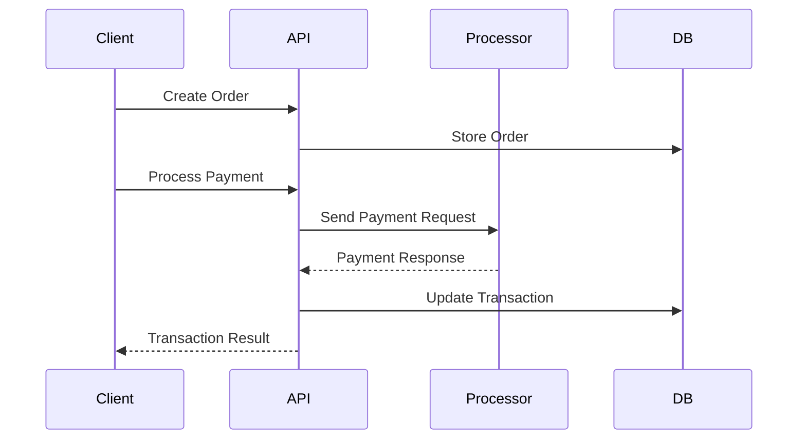

The API supports multiple payment processors to handle transactions across different sites. Each site can be configured with one or more payment processors based on their needs.

## Supported Processors

```php
enum PaymentProcessor: string
{
    case STRIPE = 'Stripe';
    case NMI = 'NMI';
    case COINBASE = 'Coinbase';
}
```

## Processor Configuration

Each site defines their available payment processors:

```json
{
  "site": {
    "identifier": "psn",
    "name": "PaystubsNow",
    "payment_processors": ["Stripe", "NMI"]
  }
}
```

## Transaction Flow



## Transaction Types

```php
enum PaymentType: string
{
    case SALE = 'Sale';
    case REFUND = 'Refund';
    case VOID = 'Void';
    case FREE = 'Free';
}
```

## Payment States

```php
enum PaymentStatus: string
{
    case PENDING = 'pending';
    case PROCESSING = 'processing';
    case COMPLETED = 'completed';
    case FAILED = 'failed';
}
```

## Implementation Examples

### Processing a Payment

```php
$transaction = Transaction::create([
    'site_id' => $site->id,
    'user_id' => $user->id,
    'order_id' => $order->id,
    'processor' => PaymentProcessor::STRIPE,
    'amount' => $order->total,
    'type' => PaymentType::SALE,
    'status' => PaymentStatus::PENDING
]);

// Process via selected processor
$result = match($transaction->processor) {
    PaymentProcessor::STRIPE => $this->processStripePayment($transaction),
    PaymentProcessor::NMI => $this->processNMIPayment($transaction),
    PaymentProcessor::COINBASE => $this->processCoinbasePayment($transaction),
};
```

### Handling Responses

```php
$transaction->update([
    'processor_id' => $result->id,
    'processor_response' => $result->response,
    'status' => PaymentStatus::COMPLETED
]);
```

## API Responses

### Successful Transaction
```json
{
  "success": true,
  "data": {
    "transaction": {
      "id": 1,
      "processor": "Stripe",
      "processor_id": "ch_1234567890",
      "amount": 29.99,
      "type": "Sale",
      "status": "completed",
      "created_at": "2024-01-29T12:00:00Z"
    }
  }
}
```

### Failed Transaction
```json
{
  "success": false,
  "message": "Payment failed",
  "errors": {
    "detail": "Card declined"
  }
}
```

## Processor Features

### Stripe
- Credit card processing
- ACH payments
- Subscription management
- Dispute handling

### NMI (Network Merchants)
- Credit card processing
- Virtual terminal
- Recurring billing
- Level 2/3 processing

### Coinbase
- Cryptocurrency payments
- Multiple currency support
- Automatic conversions
- Wallet management

## Security Considerations

1. **PCI Compliance**
- No card data storage
- Use tokenization
- Secure transmission

2. **Data Protection**
- Encrypt sensitive data
- Mask card numbers
- Secure API keys

3. **Fraud Prevention**
- Address verification
- CVV validation
- Transaction monitoring

## Best Practices

1. **Error Handling**
```php
try {
    $result = $processor->processPayment($payment);
} catch (PaymentException $e) {
    Log::error('Payment failed', [
        'code' => $e->getCode(),
        'message' => $e->getMessage()
    ]);
    return $this->handlePaymentError($e);
}
```

2. **Idempotency**
```php
$processor->processPayment($payment, [
    'idempotency_key' => $payment->uuid
]);
```

3. **Webhooks**
```php
public function handleWebhook(Request $request)
{
    $event = $this->verifyWebhook($request);
    match ($event->type) {
        'charge.succeeded' => $this->handleSuccessfulCharge($event),
        'charge.failed' => $this->handleFailedCharge($event),
        default => $this->handleUnknownEvent($event),
    };
}
```

## Common Issues

1. **Failed Transactions**
- Handle timeout errors
- Implement retry logic
- Monitor processor status

2. **Reconciliation**
- Track all transactions
- Handle partial payments
- Process refunds properly

3. **Currency Handling**
- Use proper precision
- Handle conversions
- Manage exchange rates

## Testing

### Test Cards
```php
// Stripe Test Cards
$cards = [
    'success' => '4242424242424242',
    'decline' => '4000000000000002',
    'error' => '4000000000000127'
];
```

### Test Mode
```php
config(['payment.test_mode' => true]);
```

## Monitoring

1. **Transaction Monitoring**
- Success rates
- Error patterns
- Response times

2. **Processor Health**
- Uptime tracking
- Error rates
- Performance metrics

3. **Alerts**
- High failure rates
- Unusual activity
- System issues