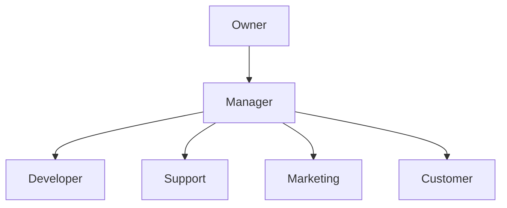

The API implements a role-based access control (RBAC) system where each user is assigned a role that determines their access permissions. This system ensures proper access control and security across all API endpoints.

## Role Structure



## Available Roles

| Role | Description | Level |
|------|-------------|-------|
| Owner | Full system access | 1 |
| Manager | Site management and user control | 2 |
| Developer | API and technical access | 2 |
| Support | Customer support capabilities | 2 |
| Marketing | Marketing and analytics access | 2 |
| Customer | Basic user permissions | 3 |

## Permission Groups

### Dashboard Permissions
```php
DASHBOARD_STATS = 'dashboard:stats'
```

### User Management
```php
USERS_LIST = 'users:list'
USERS_CREATE = 'users:create'
USERS_VIEW = 'users:view'
USERS_UPDATE = 'users:update'
USERS_DELETE = 'users:delete'
```

### Site Management
```php
SITES_LIST = 'sites:list'
SITES_CREATE = 'sites:create'
SITES_VIEW = 'sites:view'
SITES_UPDATE = 'sites:update'
SITES_DELETE = 'sites:delete'
```

### Role Management
```php
ROLES_LIST = 'roles:list'
ROLES_CREATE = 'roles:create'
ROLES_VIEW = 'roles:view'
ROLES_UPDATE = 'roles:update'
ROLES_DELETE = 'roles:delete'
```

## Role Permissions Matrix

| Permission | Owner | Manager | Developer | Support | Marketing | Customer |
|------------|-------|---------|-----------|---------|-----------|----------|
| dashboard:stats | ✓ | ✓ | ✓ | ✓ | ✓ | - |
| users:* | ✓ | ✓ | - | ✓ | - | - |
| sites:* | ✓ | - | - | - | - | - |
| roles:* | ✓ | - | - | - | - | - |

## Implementation

### Checking Permissions

```php
// In controllers or services
if ($user->role->hasPermission('users:create')) {
    // Allow user creation
}

// In blade templates
@can('users:create')
    <!-- Show create user button -->
@endcan
```

### Role Assignment

```php
// Assign role to user
$user->role()->associate($role);
$user->save();

// Check user's role
if ($user->role->name === RoleName::MANAGER) {
    // Allow manager actions
}
```

## API Responses

Roles and permissions are included in user responses:

```json
{
  "success": true,
  "data": {
    "user": {
      "id": 1,
      "name": "John Doe",
      "role": {
        "name": "Manager",
        "permissions": [
          "dashboard:stats",
          "users:list",
          "users:create",
          "users:view",
          "users:update"
        ]
      }
    }
  }
}
```

## Permission Checking

The API performs permission checks at multiple levels:

1. **Route Level**
```php
Route::middleware(['auth.sanctum', 'can:users:list'])
    ->get('/users', [UserController::class, 'index']);
```

2. **Controller Level**
```php
public function store(Request $request)
{
    $this->authorize('users:create');
    // Create user logic
}
```

3. **Policy Level**
```php
class UserPolicy
{
    public function create(User $user): bool
    {
        return $user->role->hasPermission('users:create');
    }
}
```

## Role Hierarchy

Roles follow a hierarchical structure where higher-level roles inherit permissions from lower levels:

```php
Owner (All permissions)
├── Manager
│   ├── User Management
│   └── Dashboard Access
├── Developer
│   ├── API Access
│   └── Dashboard Access
├── Support
│   ├── Customer Management
│   └── Dashboard Access
└── Customer
    └── Basic Access
```

## Best Practices

1. **Always Use Policies**
```php
// Don't check permissions directly
if ($user->role->hasPermission('users:delete')) { }

// Use policies instead
$this->authorize('delete', $user);
```

2. **Group Related Permissions**
```php
// Check multiple related permissions
if ($user->role->hasAnyPermission([
    'users:create',
    'users:update',
    'users:delete'
])) {
    // Allow user management
}
```

3. **Cache Permissions**
```php
$permissions = Cache::remember(
    "user.{$user->id}.permissions",
    now()->addHours(24),
    fn() => $user->role->permissions
);
```

## Common Issues

1. **Permission Inheritance**
- Ensure proper role hierarchy
- Check inherited permissions
- Handle permission conflicts

2. **Role Assignment**
- Validate role changes
- Check site-specific roles
- Manage role transitions

3. **Performance**
- Cache permission checks
- Optimize role queries
- Use eager loading