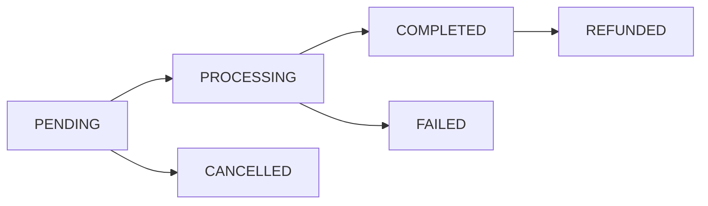

Orders represent document generation requests in the system. Each order can have multiple documents and transactions associated with it. All order operations require authentication.

## Data Structure

```json
{
  "id": 1,
  "site_id": 1,
  "user_id": 1,
  "uuid": "123e4567-e89b-12d3-a456-426614174000",
  "currency": "USD",
  "total": 299.99,
  "discount": 0.00,
  "tax": 0.00,
  "net": 299.99,
  "status": "Completed",
  "documents_count": 3,
  "transactions_count": 1,
  "created_at": "2024-01-28T12:00:00Z",
  "updated_at": "2024-01-28T12:00:00Z",
  "relationships": {
    "site": {
      "data": { "id": 1, "type": "sites" }
    },
    "user": {
      "data": { "id": 1, "type": "users" }
    },
    "documents": {
      "data": [
        { "id": 1, "type": "documents" },
        { "id": 2, "type": "documents" }
      ]
    },
    "transactions": {
      "data": [
        { "id": 1, "type": "transactions" }
      ]
    }
  }
}
```

## List Orders

Retrieve a paginated list of orders.

<CodeGroup>
  ```bash Request
  curl https://api.paystub.dev/orders \
  -H "Authorization: Bearer your_token_here"
  ```

  ```json Response
  {
    "success": true,
    "data": [
  {
    "id": 1,
    "uuid": "123e4567-e89b-12d3-a456-426614174000",
    "currency": "USD",
    "total": 299.99,
    "status": "Completed",
    "documents_count": 3,
    "transactions_count": 1,
    "created_at": "2024-01-28T12:00:00Z",
    "updated_at": "2024-01-28T12:00:00Z"
  }
    ],
    "meta": {
    "current_page": 1,
    "from": 1,
    "last_page": 3,
    "per_page": 15,
    "to": 15,
    "total": 45
  }
  }
  ```
</CodeGroup>

### Query Parameters

The API supports the following query parameters using Spatie Query Builder:

#### Filtering

- Simple Filters:
```
GET /orders?filter[status]=completed
GET /orders?filter[total]=299.99
GET /orders?filter[user_id]=1
  ```

- Range Filters:
```
GET /orders?filter[created_at:from]=2024-01-01
GET /orders?filter[created_at:to]=2024-01-31
GET /orders?filter[total:min]=100
GET /orders?filter[total:max]=500
  ```

- Multiple Values:
```
GET /orders?filter[status]=pending,processing
  ```

- Complex Filters:
```
GET /orders?filter[has_pending_documents]=true
GET /orders?filter[has_failed_transactions]=true
  ```

#### Including Relationships

You can include related models in the response:

```
GET /orders?include=documents
GET /orders?include=documents,transactions
GET /orders?include=user.site
```

Available relationships:
- `site` - The site this order belongs to
- `user` - The user who created this order
- `documents` - All documents in this order
- `transactions` - All transactions for this order

#### Sorting

Sort results by one or multiple fields:

```
GET /orders?sort=-created_at
GET /orders?sort=status,-total
```

Available sort fields:
- `created_at`
- `updated_at`
- `total`
- `status`
- `documents_count`
- `transactions_count`

#### Selecting Fields

Select specific fields to return:

```
GET /orders?fields[orders]=uuid,total,status
GET /orders?fields[orders]=uuid,total&fields[documents]=type,status
```

#### Append Computed Attributes

Include computed attributes in the response:

```
GET /orders?append=pending_documents_count
```

Available appendable attributes:
- `pending_documents_count`
- `failed_documents_count`
- `total_refunded`
- `processing_time`

#### Pagination

Control the number of results per page:

```
GET /orders?per_page=25
```

## Create Order

Create a new order record.

<CodeGroup>
  ```bash Request
  curl -X POST https://api.paystub.dev/orders \
  -H "Authorization: Bearer your_token_here" \
  -H "Content-Type: application/json" \
  -d '{
  "documents": [
{
  "type": "PAYSTUB",
  "company_id": 1,
  "employee_id": 1,
  "content": {
  "pay_period": "2024-01",
  "earnings": []
}
}
  ],
  "payment": {
  "processor": "STRIPE",
  "amount": 299.99
}
}'
  ```

  ```json Response
  {
    "success": true,
    "data": {
    "id": 1,
    "uuid": "123e4567-e89b-12d3-a456-426614174000",
    "total": 299.99,
    "status": "PENDING",
    "created_at": "2024-01-28T12:00:00Z",
    "updated_at": "2024-01-28T12:00:00Z"
  },
    "message": "Order created successfully"
  }
  ```
</CodeGroup>

### Validation Rules

| Field | Rules |
|-------|--------|
| documents | Required, array, min:1 |
| documents.*.type | Required, valid document type |
| documents.*.company_id | Required, exists in companies |
| documents.*.employee_id | Required, exists in employees |
| documents.*.content | Required, valid JSON |
| payment.processor | Required, valid processor |
| payment.amount | Required, numeric, min:0 |

## Get Order

Retrieve details of a specific order.

<CodeGroup>
  ```bash Request
  curl https://api.paystub.dev/orders/123e4567-e89b-12d3-a456-426614174000 \
  -H "Authorization: Bearer your_token_here"
  ```

  ```json Response
  {
    "success": true,
    "data": {
    "id": 1,
    "uuid": "123e4567-e89b-12d3-a456-426614174000",
    "currency": "USD",
    "total": 299.99,
    "documents": [
  {
    "id": 1,
    "type": "PAYSTUB",
    "status": "COMPLETED"
  }
    ],
    "transactions": [
  {
    "id": 1,
    "processor": "STRIPE",
    "amount": 299.99,
    "status": "COMPLETED"
  }
    ]
  }
  }
  ```
</CodeGroup>

## Cancel Order

Cancel an order if it's in a cancellable state.

<CodeGroup>
  ```bash Request
  curl -X POST https://api.paystub.dev/orders/123e4567-e89b-12d3-a456-426614174000/cancel \
  -H "Authorization: Bearer your_token_here"
  ```

  ```json Response
  {
    "success": true,
    "message": "Order cancelled successfully"
  }
  ```
</CodeGroup>

## Relationships

### BelongsTo Relationships
- `site` - The site this order belongs to
- `user` - The user who created this order

### HasMany Relationships
- `documents` - All documents in this order
- `transactions` - All transactions associated with this order

## Order Status Flow



## Security Considerations

1. Order Access
- Orders are site-scoped
- Users can only access their own orders
- Payment information is encrypted
- Order history is immutable

2. Payment Security
- Payment processor tokens are encrypted
- Amounts are validated against documents
- Refunds require special permissions
- Transaction logs are maintained

## Error Handling

### HTTP Status Codes

- 401 Unauthenticated
```json
{
  "success": false,
  "message": "Unauthenticated."
}
  ```

- 403 Unauthorized
```json
{
  "success": false,
  "message": "You are not authorized to access this order."
}
  ```

- 404 Not Found
```json
{
  "success": false,
  "message": "Order not found."
}
  ```

- 422 Validation Error
```json
{
  "success": false,
  "message": "The given data was invalid.",
  "errors": {
    "documents": ["At least one document is required."],
    "payment.amount": ["Invalid payment amount."]
  }
}
  ```

## Best Practices

1. Order Creation
- Validate all document data before creation
- Ensure proper payment information
- Use idempotency keys for requests
- Handle concurrent order creation

2. Security
- Implement rate limiting
- Monitor unusual order patterns
- Regular security audits
- Maintain PCI compliance if handling cards

3. Performance
- Cache order status when possible
- Use background jobs for processing
- Implement proper database indexes
- Monitor order processing times

4. Compliance
- Maintain detailed audit logs
- Follow data retention policies
- Regular compliance reviews
- Document all status changes