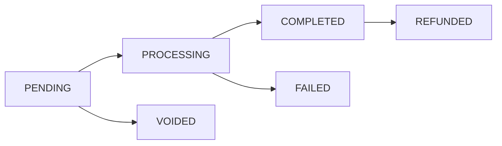

Transactions represent payment records in the system. Each transaction is associated with an order and tracks payment processing details. All transaction operations require authentication.

## Data Structure

```json
{
  "id": 1,
  "site_id": 1,
  "user_id": 1,
  "order_id": 1,
  "processor": "Stripe",
  "processor_id": "ch_123456789",
  "processor_response": {
    "status": "succeeded",
    "payment_method": "card_1234",
    "risk_score": 15
  },
  "amount": 299.99,
  "type": "Sale",
  "status": "completed",
  "created_at": "2024-01-28T12:00:00Z",
  "updated_at": "2024-01-28T12:00:00Z",
  "relationships": {
    "site": {
      "data": { "id": 1, "type": "sites" }
    },
    "user": {
      "data": { "id": 1, "type": "users" }
    },
    "order": {
      "data": { "id": 1, "type": "orders" }
    }
  }
}
```

## List Transactions

Retrieve a paginated list of transactions.

<CodeGroup>
  ```bash Request
  curl https://api.paystub.dev/transactions \
  -H "Authorization: Bearer your_token_here"
  ```

  ```json Response
  {
    "success": true,
    "data": [
  {
    "id": 1,
    "processor": "Stripe",
    "amount": 299.99,
    "type": "Sale",
    "status": "completed",
    "created_at": "2024-01-28T12:00:00Z",
    "updated_at": "2024-01-28T12:00:00Z"
  }
    ],
    "meta": {
    "current_page": 1,
    "from": 1,
    "last_page": 3,
    "per_page": 15,
    "to": 15,
    "total": 45
  }
  }
  ```
</CodeGroup>

### Query Parameters

The API supports the following query parameters using Spatie Query Builder:

#### Filtering

- Simple Filters:
```
GET /transactions?filter[status]=completed
GET /transactions?filter[type]=sale
GET /transactions?filter[processor]=stripe
  ```

- Range Filters:
```
GET /transactions?filter[created_at:from]=2024-01-01
GET /transactions?filter[created_at:to]=2024-01-31
GET /transactions?filter[amount:min]=100
GET /transactions?filter[amount:max]=500
  ```

- Multiple Values:
```
GET /transactions?filter[status]=pending,processing
GET /transactions?filter[processor]=stripe,nmi
  ```

- Complex Filters:
```
GET /transactions?filter[is_refundable]=true
GET /transactions?filter[has_risk_score]=true
  ```

#### Including Relationships

You can include related models in the response:

```
GET /transactions?include=order
GET /transactions?include=order.documents
GET /transactions?include=user,site
```

Available relationships:
- `site` - The site this transaction belongs to
- `user` - The user who initiated this transaction
- `order` - The order associated with this transaction

#### Sorting

Sort results by one or multiple fields:

```
GET /transactions?sort=-created_at
GET /transactions?sort=status,-amount
```

Available sort fields:
- `created_at`
- `updated_at`
- `amount`
- `status`
- `type`
- `processor`

#### Selecting Fields

Select specific fields to return:

```
GET /transactions?fields[transactions]=processor,amount,status
GET /transactions?fields[transactions]=type,amount&fields[order]=uuid,total
```

#### Append Computed Attributes

Include computed attributes in the response:

```
GET /transactions?append=processor_fee
```

Available appendable attributes:
- `processor_fee`
- `net_amount`
- `refundable_amount`
- `risk_level`

#### Pagination

Control the number of results per page:

```
GET /transactions?per_page=25
```

## Create Transaction

Create a new transaction record.

<CodeGroup>
  ```bash Request
  curl -X POST https://api.paystub.dev/transactions \
  -H "Authorization: Bearer your_token_here" \
  -H "Content-Type: application/json" \
  -d '{
  "order_id": 1,
  "processor": "STRIPE",
  "amount": 299.99,
  "type": "SALE",
  "processor_token": "tok_123456789"
}'
  ```

  ```json Response
  {
    "success": true,
    "data": {
    "id": 1,
    "order_id": 1,
    "processor": "STRIPE",
    "processor_id": "ch_123456789",
    "amount": 299.99,
    "type": "SALE",
    "status": "COMPLETED",
    "created_at": "2024-01-28T12:00:00Z",
    "updated_at": "2024-01-28T12:00:00Z"
  },
    "message": "Transaction created successfully"
  }
  ```
</CodeGroup>

### Validation Rules

| Field | Rules |
|-------|--------|
| order_id | Required, exists in orders table |
| processor | Required, valid payment processor |
| amount | Required, numeric, min:0.01 |
| type | Required, valid transaction type |
| processor_token | Required for new payments |
| processor_card_id | Required for saved cards |

## Get Transaction

Retrieve details of a specific transaction.

<CodeGroup>
  ```bash Request
  curl https://api.paystub.dev/transactions/1 \
  -H "Authorization: Bearer your_token_here"
  ```

  ```json Response
  {
    "success": true,
    "data": {
    "id": 1,
    "processor": "STRIPE",
    "amount": 299.99,
    "type": "SALE",
    "status": "COMPLETED",
    "processor_response": {
    "status": "succeeded",
    "payment_method": "card_1234",
    "risk_score": 15
  },
    "created_at": "2024-01-28T12:00:00Z",
    "updated_at": "2024-01-28T12:00:00Z"
  }
  }
  ```
</CodeGroup>

## Refund Transaction

Process a refund for a completed transaction.

<CodeGroup>
  ```bash Request
  curl -X POST https://api.paystub.dev/transactions/1/refund \
  -H "Authorization: Bearer your_token_here" \
  -H "Content-Type: application/json" \
  -d '{
  "amount": 299.99,
  "reason": "Customer request"
}'
  ```

  ```json Response
  {
    "success": true,
    "data": {
    "id": 2,
    "processor": "STRIPE",
    "amount": 299.99,
    "type": "REFUND",
    "status": "COMPLETED",
    "created_at": "2024-01-28T12:30:00Z"
  },
    "message": "Refund processed successfully"
  }
  ```
</CodeGroup>

## Void Transaction

Void a pending or processing transaction.

<CodeGroup>
  ```bash Request
  curl -X POST https://api.paystub.dev/transactions/1/void \
  -H "Authorization: Bearer your_token_here"
  ```

  ```json Response
  {
    "success": true,
    "data": {
    "id": 1,
    "status": "VOIDED",
    "updated_at": "2024-01-28T12:30:00Z"
  },
    "message": "Transaction voided successfully"
  }
  ```
</CodeGroup>

## Relationships

### BelongsTo Relationships
- `site` - The site this transaction belongs to
- `user` - The user who initiated the transaction
- `order` - The order associated with the transaction

## Transaction Types

1. Sale
- Standard payment transaction
- Creates a new charge
- Requires payment details or saved card

2. Refund
- Refunds a previous sale
- References original transaction
- Can be partial or full amount

3. Void
- Cancels a pending transaction
- Must be within processor timeframe
- No financial impact

4. Free
- Zero-amount transaction
- Used for free orders
- No payment processing needed

## Transaction Status Flow



## Security Considerations

1. Payment Data Protection
- Payment details are never stored
- Processor tokens are short-lived
- All amounts are validated
- Response data is sanitized

2. Access Control
- Transactions are site-scoped
- Refunds require special permissions
- Void operations are time-limited
- Full audit trail is maintained

3. PCI Compliance
- No card data in logs
- Secure token transmission
- Regular security scans
- Employee training required

## Error Handling

### HTTP Status Codes

- 401 Unauthenticated
```json
{
  "success": false,
  "message": "Unauthenticated."
}
  ```

- 403 Unauthorized
```json
{
  "success": false,
  "message": "You are not authorized to process transactions."
}
  ```

- 404 Not Found
```json
{
  "success": false,
  "message": "Transaction not found."
}
  ```

- 422 Validation Error
```json
{
  "success": false,
  "message": "The given data was invalid.",
  "errors": {
    "amount": ["Invalid transaction amount."],
    "processor_token": ["Invalid or expired token."]
  }
}
  ```

### Processor-Specific Errors

- Card Declined
```json
{
  "success": false,
  "message": "The card was declined.",
  "error_code": "card_declined",
  "processor_message": "Card declined: insufficient funds"
}
  ```

## Best Practices

1. Transaction Processing
- Use idempotency keys
- Validate amounts before processing
- Handle timeouts gracefully
- Implement retry logic
- Monitor success rates

2. Security
- Regular security audits
- Monitor unusual patterns
- Implement rate limiting
- Track IP addresses
- Validate request origins

3. Performance
- Optimize database queries
- Cache processor responses
- Use background jobs
- Monitor processing times
- Set proper timeouts

4. Compliance
- Maintain audit logs
- Follow data retention policies
- Regular compliance reviews
- Document all procedures
- Train support staff

5. Error Handling
- Proper error logging
- User-friendly messages
- Consistent error format
- Recovery procedures
- Support documentation

6. Reconciliation
- Daily balance checks
- Automated reconciliation
- Discrepancy alerts
- Regular reporting
- Clear documentation